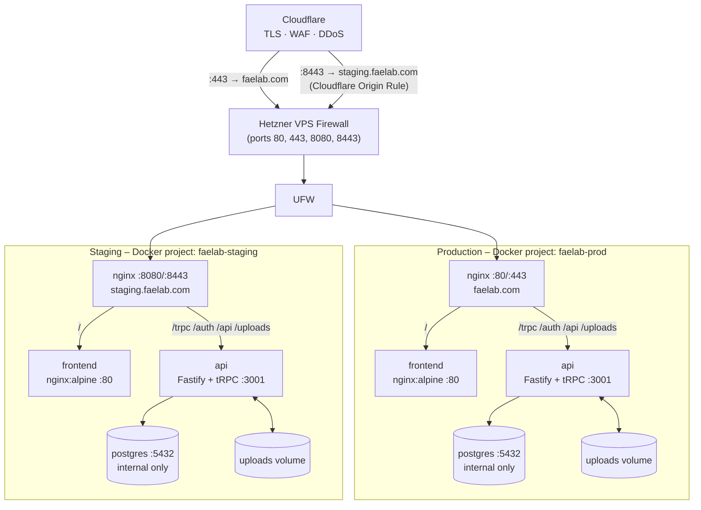

# FaeLab

## Overview
FaeLab started out as a portfolio website but has over time evolved into something of a personal platform — featuring a content management system, file uploads, video hosting, and GitHub OAuth authentication.

## Architecture

All services run as Docker containers on a Hetzner VPS, sitting behind Cloudflare. Two independent stacks run on the same VPS: production (`faelab.com`) and staging (`staging.faelab.com`).



## CI/CD

Images are built in GitHub Actions and pushed to GHCR. The VPS pulls pre-built images — nothing is built on the server.

```
Push to main
  └─► build.yml       builds api + frontend → ghcr.io/.../api:main + sha-xxxxxxx
  └─► deploy-staging  SSHes into VPS, pulls sha-xxxxxxx, restarts faelab-staging stack

Push v1.2.3 tag
  └─► build.yml       builds api + frontend → ghcr.io/.../api:1.2.3 + 1.2 + 1 + latest + sha-*
  └─► deploy-prod     manual trigger in GitHub Actions UI (requires approval), deploys 1.2.3
```

Image tags produced per trigger:

| Trigger | Tags |
|---|---|
| `v1.2.3` tag | `1.2.3`, `1.2`, `1`, `latest`, `sha-xxxxxxx` |
| `main` push | `main`, `sha-xxxxxxx` |

### Required GitHub configuration

**Repository variables** (Settings → Secrets and variables → Actions → Variables):

| Variable | Value |
|---|---|
| `STAGING_API_BASE_URL` | `https://staging.faelab.com` |
| `PROD_API_BASE_URL` | `https://faelab.com` |

**Environments** (Settings → Environments) — one for `staging`, one for `production`:

| Secret / Variable | Description |
|---|---|
| Secret `DEPLOY_HOST` | VPS IP address |
| Secret `DEPLOY_USER` | SSH user (`deploy`) |
| Secret `DEPLOY_SSH_KEY` | Ed25519 private key for the deploy user |
| Secret `GHCR_PAT` | Classic GitHub PAT with `read:packages` scope |
| Variable `DEPLOY_PATH` | Absolute path on VPS (e.g. `/home/deploy/faelab`) |
| Variable `DEPLOY_SSH_PORT` | SSH port |
| Variable `GHCR_USER` | GitHub username (`faering`) |

The `production` environment has a required-reviewer approval gate — deploys pause until manually approved in the GitHub Actions UI.

## Tech Stack

| Layer | Technology |
|---|---|
| Frontend | React, TypeScript, Tailwind CSS, Vite |
| API | Fastify, tRPC, Zod |
| Database | PostgreSQL 16 |
| Auth | GitHub OAuth / local admin (server-side sessions) |
| Infrastructure | Docker, Nginx, Hetzner VPS, Cloudflare |
| CI/CD | GitHub Actions, GHCR |
| Package manager | pnpm (monorepo) |

## Local Development

**Prerequisites:** Node.js LTS, pnpm, Docker

1. Clone and install dependencies:

```sh
git clone https://github.com/faering/faelab.git
cd faelab
pnpm install
```

2. Copy the example env file and fill in values:

```sh
cp .env.example .env
```

3. Create Docker secret files (gitignored — never commit these):

```sh
mkdir -p secrets
printf 'strong-postgres-password'    > secrets/postgres_password.txt
printf 'strong-pgadmin-password'     > secrets/pgadmin_password.txt
printf 'strong-cms-admin-password'   > secrets/auth_admin_password.txt
printf 'strong-github-client-secret' > secrets/github_client_secret.txt
openssl rand -hex 64                 > secrets/auth_session_secret.txt
chmod 600 .env secrets/*.txt
```

4. Start the database and pgAdmin:

```sh
docker compose -f docker-compose.yml -f docker-compose.dev.yml up -d
```

5. Run database migrations:

```sh
docker compose exec postgres psql -U faelab -d faelab -f /dev/stdin < packages/db/migrations.sql
```

6. Start the API and frontend natively (hot-reload):

```sh
pnpm dev
```

| Service | URL |
|---|---|
| Frontend | http://localhost:5173 |
| API | http://localhost:3001 |
| pgAdmin | http://localhost:5050 |

Run individually:

```sh
pnpm frontend:dev   # Vite dev server only
pnpm api:dev        # Fastify API only
```

Useful API endpoints during development:

- `GET /auth/me` — check current session
- `GET /auth/method` — see active auth method

## Deployment

Deployments are automated via GitHub Actions. To trigger them:

**Staging** — push any commit to `main`. The staging deploy runs automatically after the build succeeds.

**Production** — push a semver tag, then manually trigger the deploy workflow:

```sh
git tag v1.2.3
git push origin v1.2.3
# Then: GitHub → Actions → Deploy – Production → Run workflow → enter "1.2.3"
```

### First-time VPS setup

On a fresh VPS, before the first automated deploy:

1. Install Docker from the official apt repository (see [Docker docs](https://docs.docker.com/engine/install/ubuntu/))
2. Create the deploy user and directories:

```sh
sudo useradd --system --create-home --shell /bin/bash deploy
sudo usermod -aG docker deploy
sudo mkdir -p /home/deploy/faelab /home/deploy/faelab-staging
sudo chown -R deploy:deploy /home/deploy/faelab /home/deploy/faelab-staging
```

3. Clone the repo into both deploy paths and create `.env` + `secrets/` at each path
4. Run migrations once at each path:

```sh
docker compose exec postgres psql -U faelab -d faelab -f /dev/stdin < packages/db/migrations.sql
```

Access pgAdmin via SSH tunnel (bound to loopback only — not publicly exposed):

```sh
# Production (port 5050)
ssh -L 5050:localhost:5050 deploy@yourserver

# Staging (port 5051)
ssh -L 5051:localhost:5051 deploy@yourserver
```

Then open http://localhost:5050 or http://localhost:5051 locally.

## Testing

No automated test suite yet.

## Contributing

This is a personal project. Issues and suggestions are welcome via [GitHub Issues](https://github.com/faering/faelab/issues).


